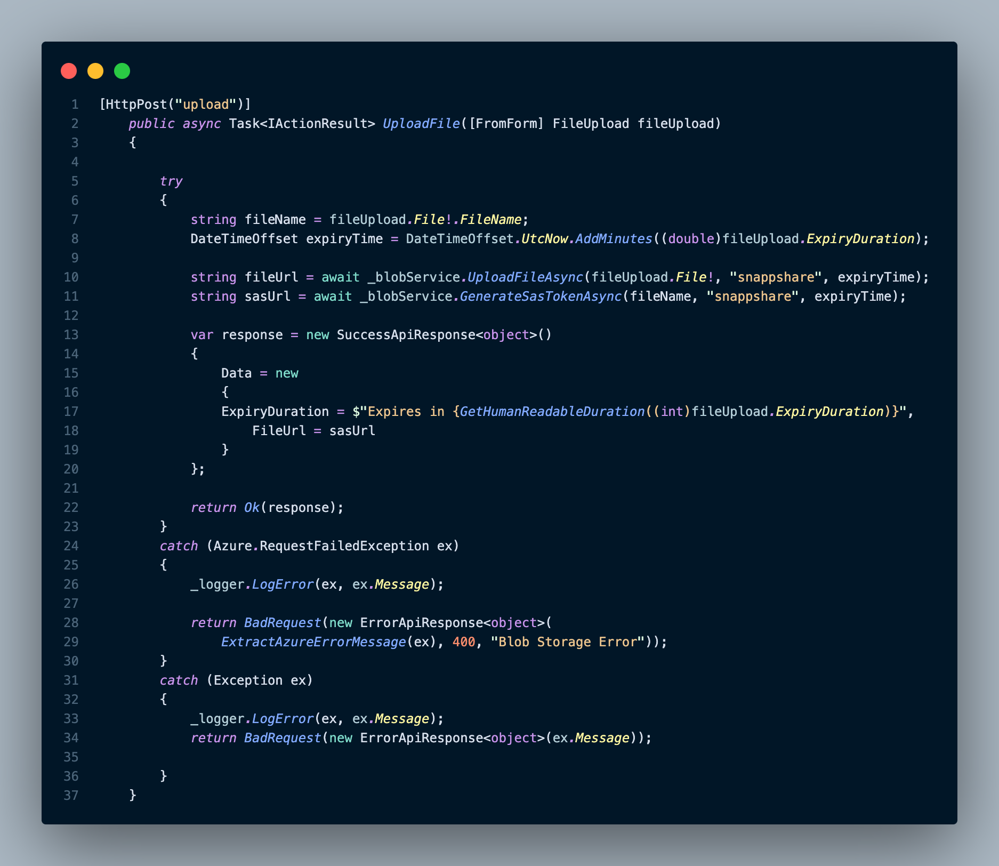
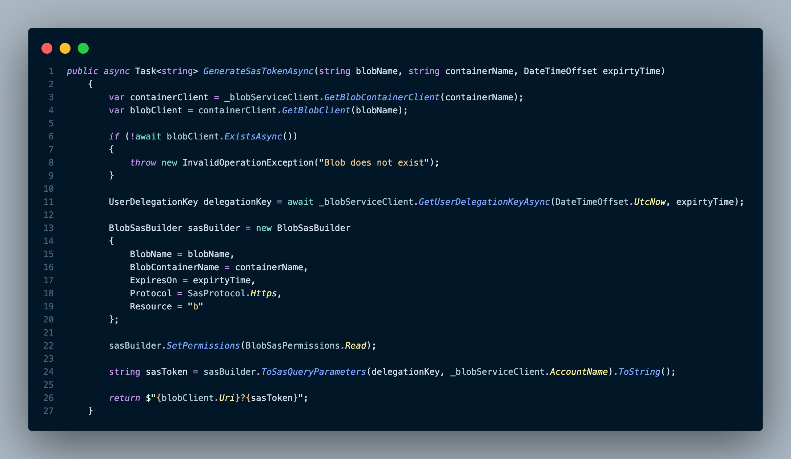
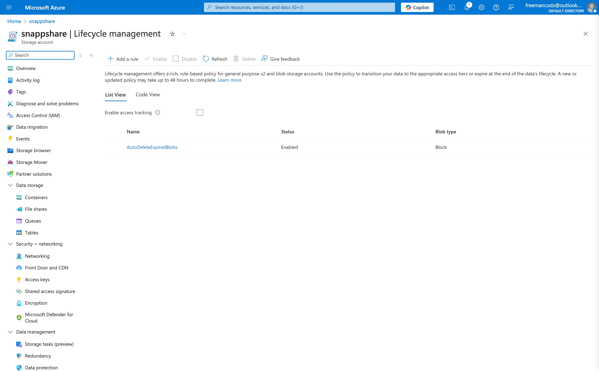
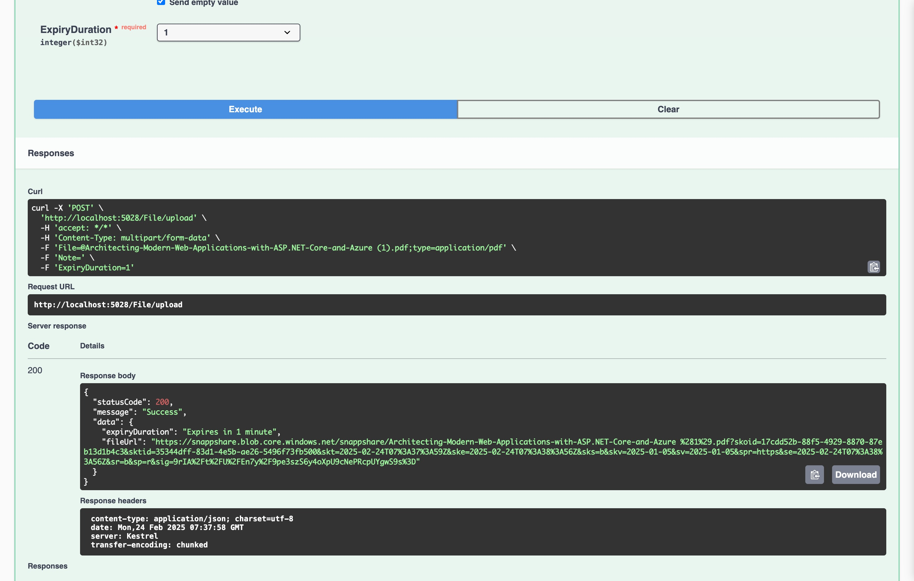
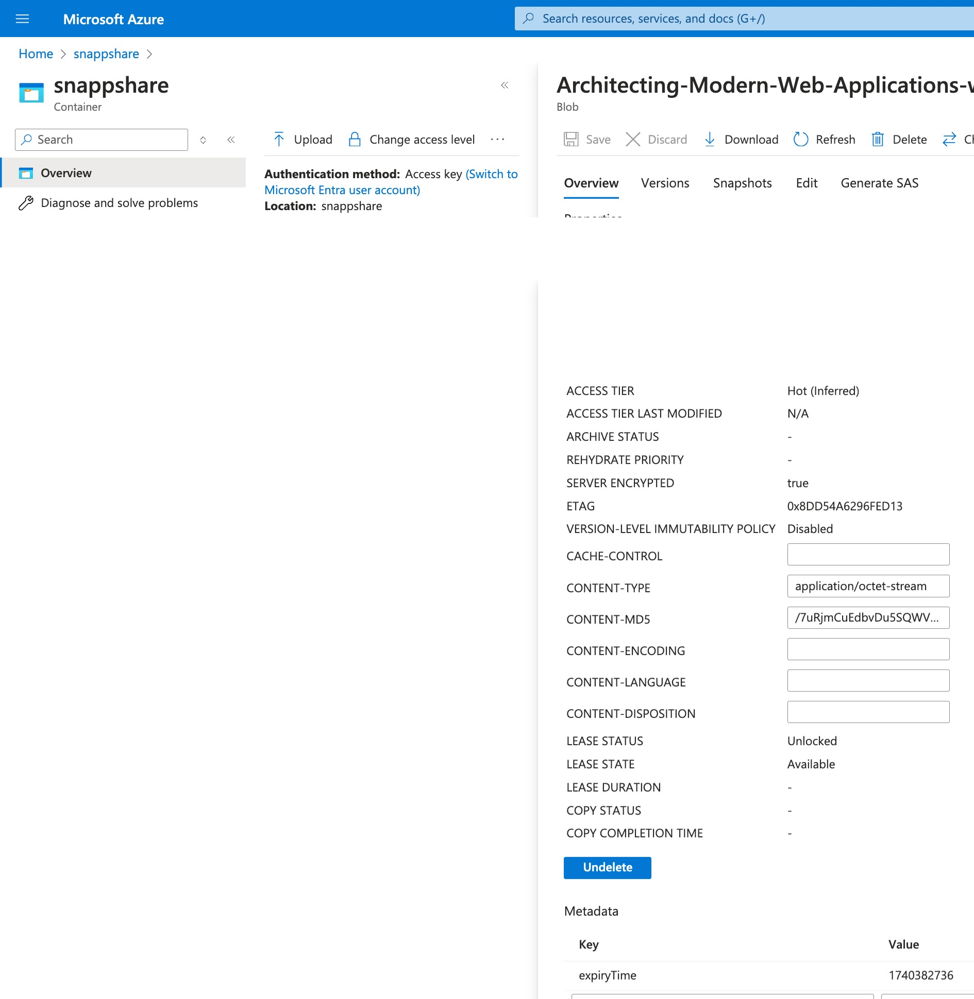

# SnappShare

SnappShare is a simple, secure, and time-sensitive file-sharing API powered by **Azure Blob Storage**. Users can upload files, generate **self-expiring** links, and have files automatically deleted after a set duration using Azure's **Lifecycle Management**.

## Features

- 📤 **File Upload**: Upload files to an Azure Blob Storage container.
- ⏳ **Expiring File Links**: Generate **SAS tokens** that expire based on user-defined duration.
- 🗑️ **Auto Deletion**: Files are automatically removed using Azure **Lifecycle Management**.
- 📄 **API Documentation**: Fully documented API using **Swagger UI**.

## How It Works

1. **Upload a File** → Specify an expiry duration (e.g., 10 minutes, 1 hour, etc.).
2. **Generate a Secure Link** → A SAS (Shared Access Signature) token is generated, allowing temporary access.
3. **File Auto-Deletion** → Azure Lifecycle Management automatically deletes expired files.

## API Endpoints

### Upload File
```
POST /File/upload
```
- **Request**: Multipart form-data with `File` and `ExpiryDuration`
- **Response**: A **temporary** URL that expires based on the duration provided.

### Example Response
```json
{
  "statusCode": 200,
  "message": "Success",
  "data": {
    "expiryDuration": "Expires in 10 minutes",
    "fileUrl": "https://snappshare.blob.core.windows.net/..."
  }
}
```

## Setup & Deployment

### Requirements
- .NET 8
- Azure Storage Account
- Azure Blob Storage
- Azure Lifecycle Management (for auto-deletion)

### Environment Variables
- Setup a Service Principal in Azure 
- Create a **.env** file with:
```
AZURE_CLIENT_ID=
AZURE_TENANT_ID=
AZURE_CLIENT_SECRET=
```
- Add Your Storage Account Name in appsetting.json:
```
STORAGE_ACCOUNT_NAME
```

### Running Locally
```
dotnet run
```

## Screenshots
📌 **Code Samples:**



📌 **Azure Integration:**




📩 **Have ideas or questions? Let's connect!**

-   **Twitter (X):** [@freemancodz](https://x.com/freemancodz)
-   **LinkedIn:** [Freeman Madudili](https://www.linkedin.com/in/freeman-madudili-9864101a2/)

